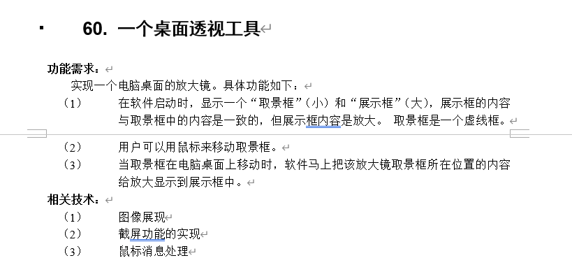
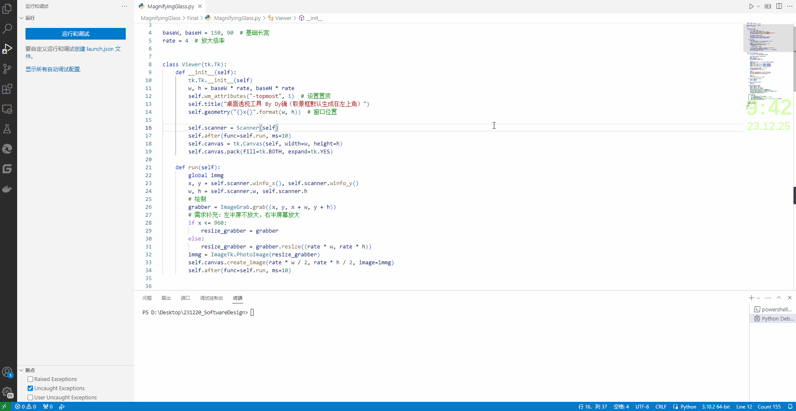

# 桌面透视工具（放大镜）

## 直接运行

```bash
python Final/MagnifyingGlass.py
```



## 相关技术

整体利用 Python 实现。

- 图像展现利用 tkinter 的 Canvas；
- 截屏功能利用了 ImageGrab，缩放用了 resize 函数；
- 鼠标消息则是 tk 提供的 bind 函数。

具体的基本都注释了，程序相当简单，基本是调包。

## 其他文件

AboutStudy 是相关技术支持的学习文件，代码混乱，效果不明，基本从网上摘取，请自行鉴别后学习

## 演示


